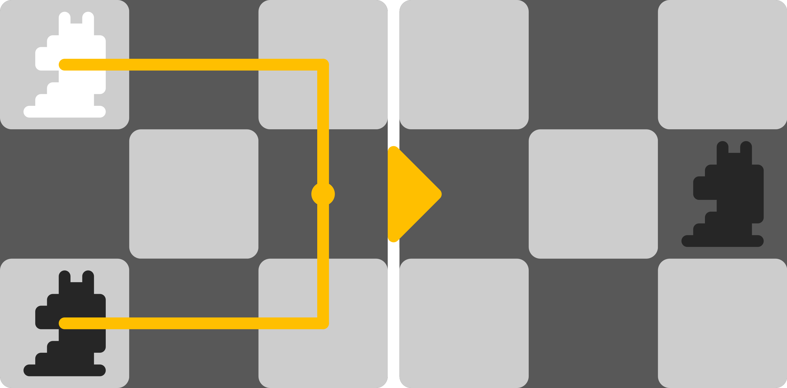
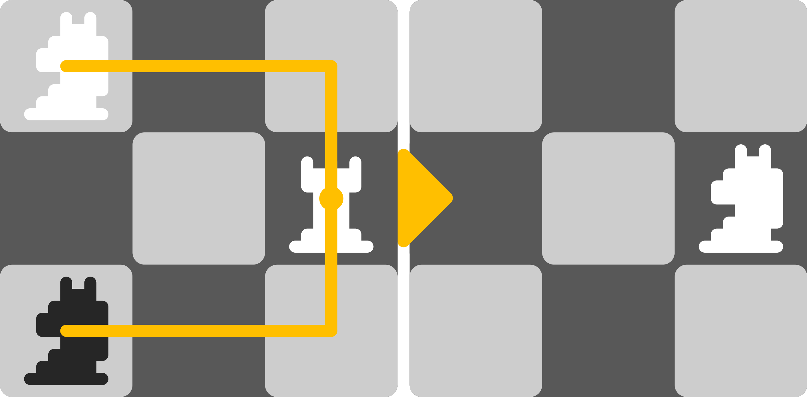
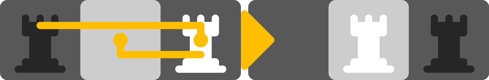
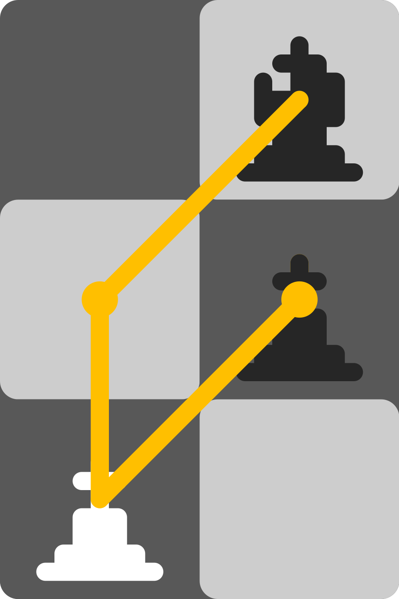
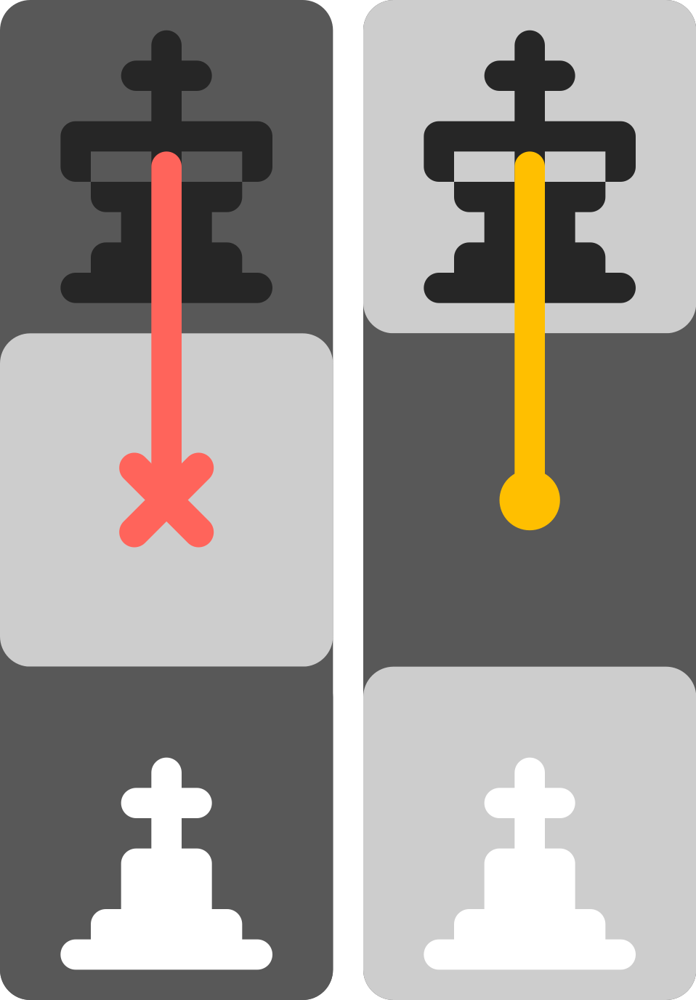
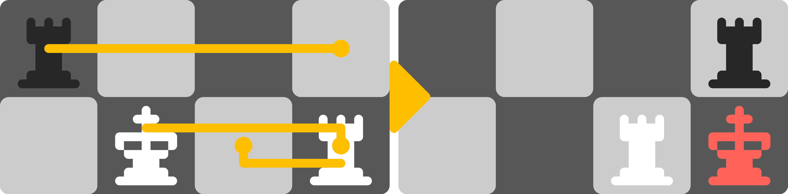
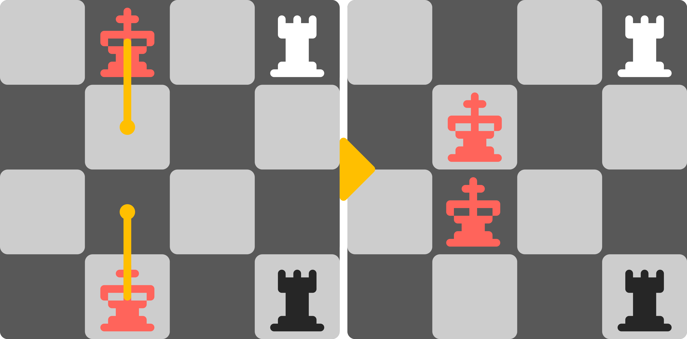
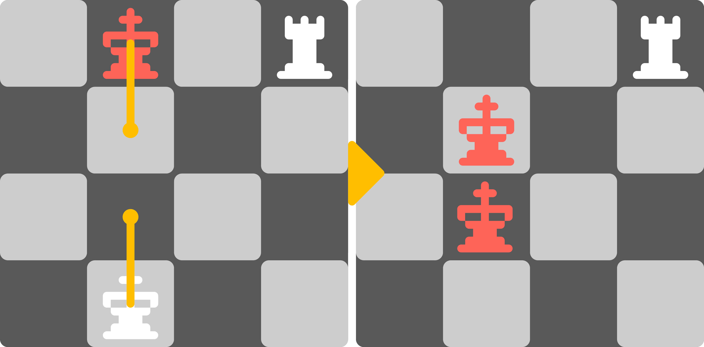
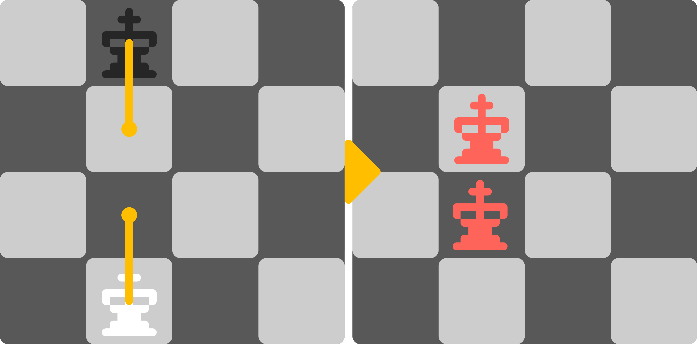

# ♟️ Chess2 — Синхронные шахматы нового поколения

[](https://github.com/Q2369/Chess2)
[](https://q2369.github.io/Chess2/)
[](https://github.com/Q2369/Chess2)
[](https://developer.mozilla.org/ru/docs/Web/JavaScript)

**Chess2** — это революционная вариация классических шахмат с синхронными ходами, которая уравнивает шансы противников и добавляет глубину стратегическому мышлению.

## 🎯 Основная идея

В отличие от традиционных шахмат, где игроки ходят по очереди, в Chess2 оба игрока делают ходы **одновременно**. Ходы записываются скрыто, затем вскрываются, что создаёт совершенно новую динамику игры и требует предугадывания действий противника.

## ✨ Ключевые особенности

- 🔄 **Синхронные ходы** — оба игрока ходят одновременно
- ⚔️ **Умные столкновения** — при ходе на одну клетку побеждает фигура, чей цвет совпадает с цветом клетки
- 🛡️ **Тактические жертвы** — можно пожертвовать фигурой, заняв её позицию
- 👑 **Особые правила для короля** — короля можно атаковать, но нельзя брать
- 📱 **Адаптивный дизайн** — играйте на ПК, планшете или телефоне
- 🤖 **Бот** — тренируйтесь против простейшего ИИ
- 👥 **Локальный мультиплеер** — играйте вдвоём на одном устройстве

## 📜 Правила игры

### Основные отличия от классических шахмат

1. **Все фигуры ходят как в обычных шахматах** с нюансами, описанными ниже

2. **Синхронность**: Оба игрока ходят одновременно (ходы записываются скрыто, затем вскрываются)

3. **Столкновение на клетке**: При одновременном ходе на одну и ту же клетку её занимает та фигура, цвет которой соответствует цвету занимаемой клетки, а другая фигура снимается с доски
   
   

4. **Жертва фигуры**: Игрок может пожертвовать своей атакованной фигурой (кроме короля), заняв её позицию. Фигура удаляется всегда, даже если противник не атаковал. При атаке вражеской фигурой происходит обмен — вражеская фигура снимается (игнорируется правило 3)
   
   

5. **Уход из-под атаки**: Возможен уход из-под атаки ходом навстречу противнику или в другую сторону. Это правило является аналогом ухода из-под атаки в обычных шахматах
   
   

6. **Пешки**: 
   - Пешка не может есть на проходе
   - Пешка берёт по диагонали только если на целевой клетке уже стоит фигура
   - Пешка берёт по вертикали только при столкновении по правилу 3
   
   

7. **Король**:
   - Короля можно атаковать, но нельзя брать
   - Король не может занимать атакованную клетку, а значит не может поедать свои фигуры
   - Король не может вставать на клетку, которую может занять вражеская пешка, если занимаемая клетка не соответствует цвету короля
   
   

8. **Рокировка**: Как в обычных шахматах, но может случиться, что король в конце хода будет атакован из-за движения фигуры противника
   
   

9. **Взаимное сближение королей**:
   - Взаимный мат — ничья
   
     
   
   - Мат одной стороне — победа другой
   
     
   
   - Взаимный шах — оба короля должны отступить
   
     

10. **Защита короля**:
    - Если король не под шахом, любой ход фигуры не должен приводить к тому, что король окажется под атакой
    - Король под шахом не обязан уходить с атакованной клетки, но может уйти только на безопасную клетку
    - Пока король под шахом, остальные фигуры могут ходить свободно (не обязаны защищать короля)

11. **Мат**: Объявляется, когда король находится под шахом и не может спастись ни одним из доступных способов

> 💡 **Примечание**: Все остальные правила соответствуют классическим шахматам, если они не противоречат новым правилам.

## 🚀 Как начать играть

### 🌐 Онлайн (рекомендуется)

Просто откройте игру в браузере:

👉 **[Играть онлайн](https://q2369.github.io/Chess2/)**

### 💻 Локально

1. **Скачайте репозиторий**:
   ```bash
   git clone https://github.com/Q2369/Chess2.git
   cd Chess2
