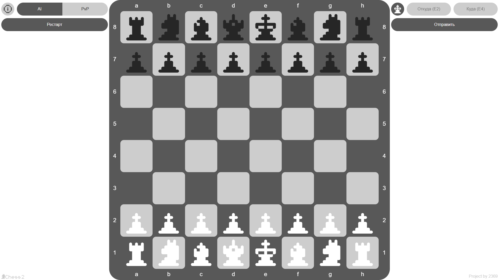
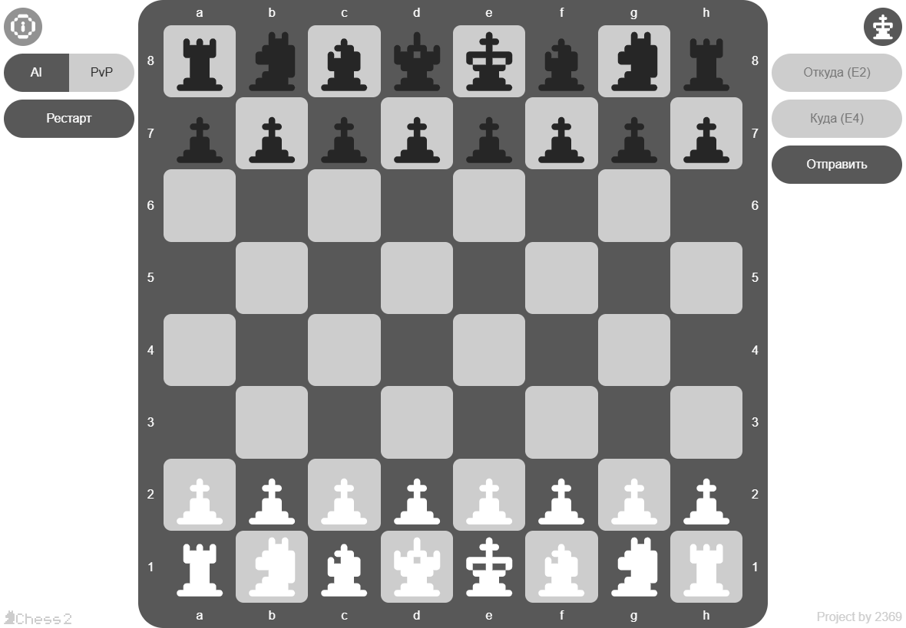
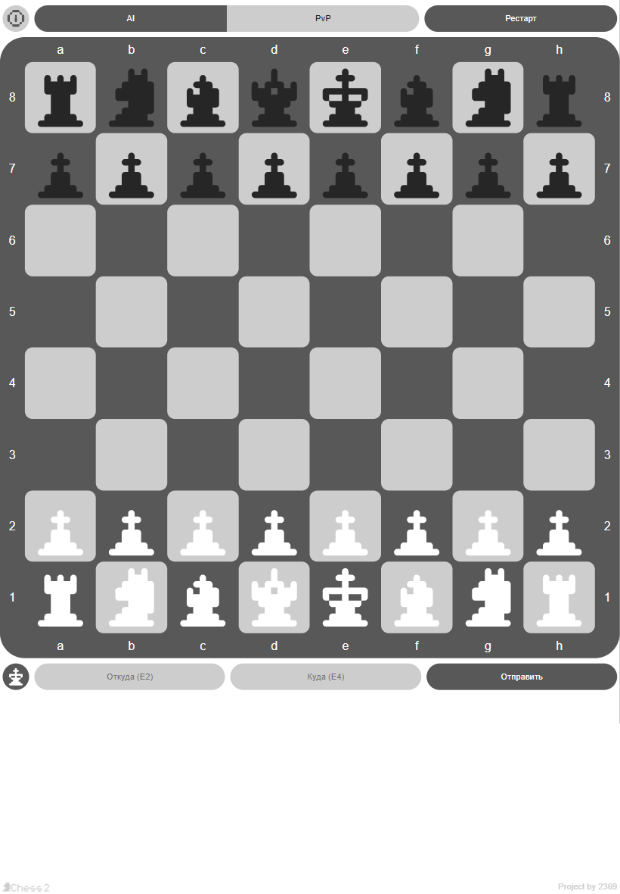
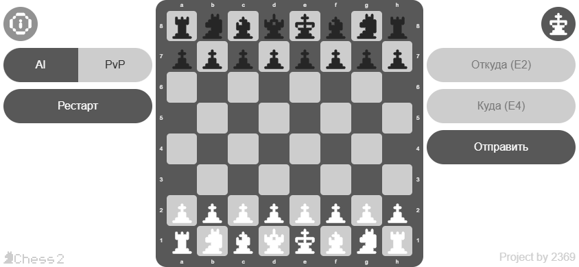
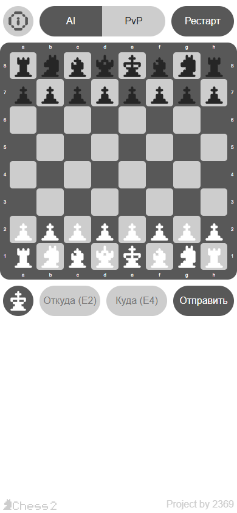

# Chess2 - Синхронные шахматы

**Chess2** - это вариация классических шахмат с синхронными ходами, которая уравнивает шансы противников и добавляет глубину стратегическому мышлению.

## Основная идея

В отличие от традиционных шахмат, где игроки ходят по очереди, в Chess2 оба игрока делают ходы **одновременно**. Ходы записываются скрыто, затем вскрываются, что создаёт совершенно новую динамику игры и требует предугадывания действий противника.

## Ключевые особенности

- **Синхронные ходы** - оба игрока ходят одновременно
- **Умные столкновения** - при ходе на одну клетку побеждает фигура, чей цвет совпадает с цветом клетки
- **Тактические жертвы** - можно пожертвовать фигурой, заняв её позицию
- **Особые правила для короля** - королю можно угрожать, но нельзя брать
- **Адаптивный дизайн** - играйте на ПК, планшете или телефоне
- **Бот** - простейший бот для ознакомления с правилами игры
- **Локальный мультиплеер** - играйте вдвоём на одном устройстве

## Дизайн и UX-решения

### Типографика
Для интерфейса выбран шрифт **Helvetica**. Его лаконичность и отсутствие засечек облегчают считывание информации, а нейтральный характер снижает градус формальности, делая игру более дружелюбной.

### Логотип
Логотип намеренно сделан минималистичным и ненавязчивым, чтобы не перегружать экран. Будучи текстовым, он отсылает к классическим шахматам, подчеркивая преемственность, но современный стиль намекает на улучшенный пользовательский опыт.

### Навигация и управление
*   **Кнопка "Info":** Выполнена в фирменном стиле и визуально перекликается с индикатором цвета игрока, создавая единую систему навигации.
*   **Переключатели режимов (AI/PvP):** Визуально объединены в группу без лишних разделителей, что показывает их взаимосвязь. Активный режим выделяется цветом.
*   **Кнопка "Рестарт":** Выделена темным цветом, так как это часто используемое действие. Её визуальный вес соответствует важности функции.
*   **Индикатор хода:** Отображает фигуру текущего игрока на контрастном фоне (в цвете одной из клеток доски), что обеспечивает мгновенное считывание информации.

### Формы ввода
Поля ввода визуально менее акцентны, чем игровые элементы, так как не являются обязательными для каждой партии. Текст-подсказка (placeholder) имеет пониженную контрастность, чтобы не отвлекать от основного процесса. Кнопка отправки формы, напротив, контрастна и сопоставима по важности с кнопкой "Рестарт".

### Геометрия и стиль
*   **Скругления:** Все элементы управления имеют полное скругление углов. Это смягчает интерфейс, снижает визуальный шум и улучшает разделение элементов.
*   **Игровое поле:** Сохраняет пропорции 1:1 и стремится занять максимум доступного пространства. Углы клеток и самого поля скруглены гармонично друг относительно друга (радиус клетки + отступ), поддерживая общий "мягкий" стиль.
*   **Фигуры:** Выполнены в стиле пиксель-арт, но со скругленными выпуклыми углами. Это смягчает резкость пикселей и добавляет уникальности. Размер сетки фигур минимизирован для четкого считывания даже на небольших экранах.

### Адаптивность
*   **Desktop (горизонтальная ориентация):** Элементы управления расположены по бокам от доски. При уменьшении ширины окна кнопки группируются сверху, освобождая место для игрового поля.
*   **Mobile (вертикальная ориентация):** Элементы управления располагаются над и под доской, занимая всю ширину экрана. Поле прижимается к верху, оставляя место для виртуальной клавиатуры при необходимости.

### Цветовая схема
*   **Основа цветовой палитры:** Серый - нейтральный цвет, не несущий смысловой нагрузки.
*   **Акцент:** Янтарный. Используется как антагонист бледно-серому, привлекая внимание, но сохраняя дружелюбный тон.
*   **Предупреждения (Шах):** Розово-красный цвет. Имеет ту же насыщенность, что и янтарный, но ассоциируется с опасностью/вниманием.
*   **Читаемость:** Цвета клеток подобраны так, чтобы обеспечивать высокий контраст как для светлых, так и для темных фигур.
*   **Комфорт глаз:** Избегается использование чистого черного (#000) и кислотных оттенков, чтобы снизить визуальную "тяжесть" и утомляемость глаз.
*   **Hover-эффекты:** Для подсветки клеток и кнопок при наведении используется промежуточный оттенок, обеспечивающий плавный переход.

### Оформление правил
Правила представлены нумерованным списком (важна последовательность). Сложные моменты подкреплены иллюстрациями в том же стиле, что и интерфейс. Иллюстрации лишены лишних деталей (только необходимые фигуры), что ускоряет восприятие информации.

## Правила игры

### Основные отличия от классических шахмат

1. Все фигуры ходят как в обычных шахматах с нюансами, описанными ниже

2. Оба игрока ходят одновременно (ходы записываются скрыто, затем вскрываются)

3. При одновременном ходе на одну и ту же клетку её занимает та фигура, цвет которой соответствует цвету занимаемой клетки, а другая фигура снимается с доски
   
   

4. Игрок может пожертвовать своей атакованной фигурой (кроме короля), заняв её позицию. Фигура удаляется всегда, даже если противник не атаковал. При атаке вражеской фигурой происходит обмен - вражеская фигура снимается (игнорируется правило 3)
   
   

5. Возможен уход из-под атаки ходом навстречу противнику или в другую сторону. Это правило является аналогом ухода из-под атаки в обычных шахматах
   
   

6. Пешка не может есть на проходе

7. Пешка берёт по диагонали только если на целевой клетке уже стоит фигура

8. Пешка берёт по вертикали только при столкновении по правилу 3
   
   

9. Короля можно атаковать, но нельзя брать

10. Король не может занимать атакованную клетку, а значит не может поедать свои фигуры

11. Рокировка как в обычных шахматах, но может случиться, что король в конце хода будет атакован из-за движения фигуры противника
   
   

12. При одновременном сближении королей:
    - взаимный мат - ничья
      
      
    
    - мат одной стороне - победа другой
      
      
    
    - взаимный шах - оба короля должны отступить
      
      

13. Если король не под шахом, любой ход фигуры не должен приводить к тому, что король окажется под атакой

14. Король не может вставать на клетку, которую может занять вражеская пешка, если занимаемая клетка не соответствует цвету короля
   
   

15. Король под шахом не обязан уходить с атакованной клетки, но может уйти только на безопасную клетку

16. Пока король под шахом, остальные фигуры могут ходить свободно (не обязаны защищать короля)

17. Мат объявляется, когда король находится под шахом и не может спастись ни одним из доступных способов

> **Примечание**: Все остальные правила соответствуют классическим шахматам, если они не противоречат новым правилам.

## Как начать играть

### Онлайн (рекомендуется)

Просто откройте игру в браузере:

 **[Играть онлайн](https://q2369.github.io/Chess2/)**

### Локально

1. **Скачайте репозиторий**:
   `git clone https://github.com/Q2369/Chess2.git`
   `cd Chess2`

2. **Откройте файл** `index.html` в любом современном браузере

### Android

Скачайте и установите **chess2.apk** на ваше Android-устройство:

 **[Скачать chess2.apk](https://github.com/Q2369/Chess2/releases/download/v1.0/chess2.apk)** *(файл находится в репозитории)*

## Скриншоты

### Desktop

### Планшет
| Горизонтальная ориентация | Вертикальная ориентация |
|---------------------------|-------------------------|
|  |  |

### Телефон
| Горизонтальная ориентация | Вертикальная ориентация |
|---------------------------|-------------------------|
|  |  |

## Режимы игры

- **Игра с ботом** - тренируйтесь против простейшего бота для понимания правил
- **Локальный мультиплеер** - играйте вдвоём на одном устройстве (планшет, телефон или ПК)

## Адаптация для реальной доски

Chess2 легко адаптируется для игры на физической шахматной доске:

1. Используйте листы бумаги для записи ходов
2. Оба игрока одновременно записывают свой ход
3. По сигналу ходы вскрываются и выполняются на доске
4. Применяйте правила столкновений и жертв
